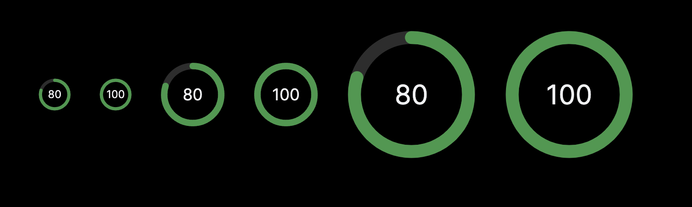

# vercel/gauge

This is the open-source Tailwindcss version of Vercel's beautiful Gauge React component to indicate a status.


## Demo

View the demo here: https://gauge-demo.vercel.app

View the original Vercel design system here: [Gauge](https://vercel.com/design/gauge)


## Installation

### Requirements

- `tailwindcss`
- `tailwindcss-animate`


It's pretty easy to install. I made it a standalone component that you can copy in your codebase.

1. Copy the `gauge` component
   ```sh
   cp ./app/gauge.tsx your-project/components/gauge.tsx
   ```

   or go directly to it here: [gauge.tsx](https://github.com/mfts/gauge-demo/blob/main/app/gauge.tsx)
   

2. Add keyframes and animation to your `tailwind.config.ts`
   ```ts
   import type { Config } from 'tailwindcss'

   const config: Config = {
     content: [
       "./pages/**/*.{js,ts,jsx,tsx,mdx}",
       "./components/**/*.{js,ts,jsx,tsx,mdx}",
       "./app/**/*.{js,ts,jsx,tsx,mdx}",
     ],
     theme: {
       extend: {
         keyframes: {
           gauge_fadeIn: {
             from: { opacity: "0" },
             to: { opacity: "1" },
           },
           gauge_fill: {
             from: { "stroke-dashoffset": "332", opacity: "0" },
             to: { opacity: "1" },
           },
         },
         animation: {
           gauge_fadeIn: "gauge_fadeIn 1s ease forwards",
           gauge_fill: "gauge_fill 1s ease forwards",
         },
       },
     },
     plugins: [require("tailwindcss-animate")],
   };
   export default config

   ```

3. Import into your page
   ```ts
   import { Gauge } from "@/components/gauge";

   export default function Home() {
     return (
      <>
        // ...
        <Gauge value={80} size="small" showValue={true} />
        // ...
      </>
     )
   }
   ```


## API

The `Gauge` component takes three props: `value`, `size`, `showValue`.

- `value`: a **number** from `0` to `100`
- `size`: a **string** ("small", "medium", "large"). Defaults to: `"small"`
- `showValue`: a **boolean** to show the number inside the gauge or not. Defaults to: `true`


## Inspiration

- Thanks to the [@vercel](https://x.com/vercel) design team for the awesome component.
- Thanks to [@shadcn](https://x.com/shadcn) who gave me a new joy for UI design.